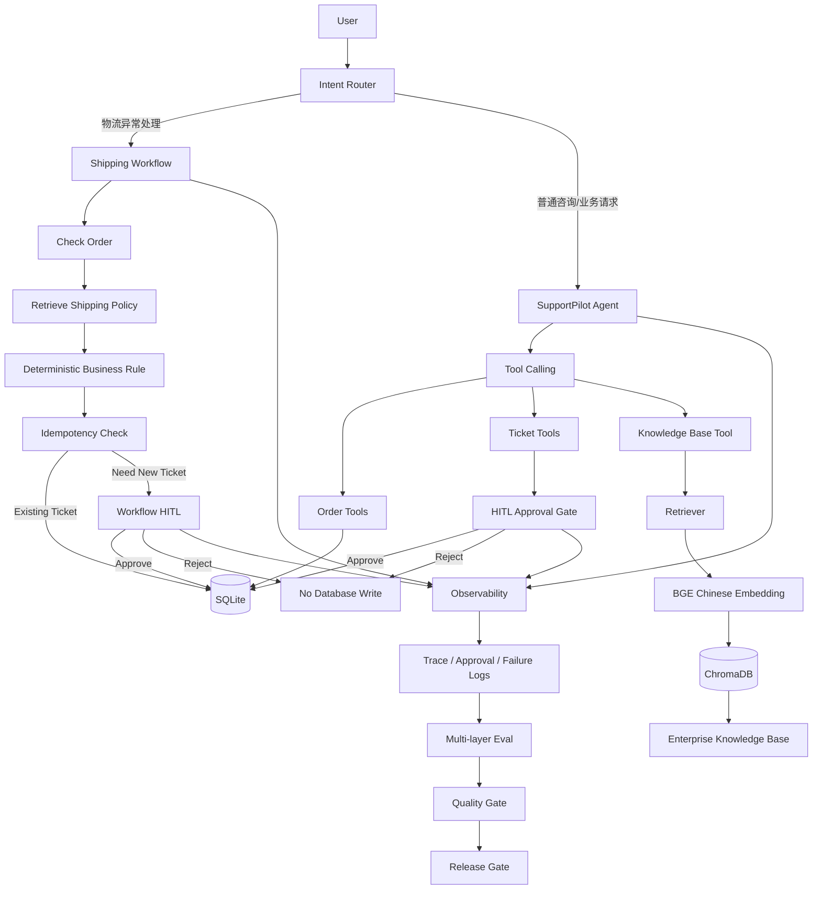
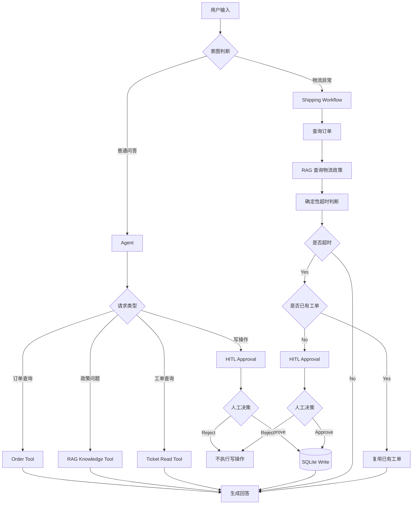

# SupportPilot

企业智能客服 Agent：结合 Tool Calling、RAG、确定性 Workflow、HITL、Observability 与 Multi-layer Eval，构建可控、可审计、可评估的客服自动化系统。

## Project Highlights

### 1. Agent Tool Calling

SupportPilot 使用 Agent Tool Calling 连接真实业务能力，而不是只让大模型进行文本问答。

目前支持：

- 查询订单状态
- 查询工单状态
- 创建售后工单
- 修改工单状态
- 查询企业知识库

Agent 负责理解用户意图，业务数据由 Tool 和 SQLite 提供，避免模型自行编造订单和工单信息。

### 2. Enterprise RAG

针对退换货、物流、退款和会员政策构建企业知识库。

RAG Pipeline：

```text
User Query
→ BGE Chinese Embedding
→ ChromaDB Retrieval
→ Similarity Threshold
→ Relevant Knowledge Chunks
→ Agent Answer + Source Citation

BAAI/bge-small-zh-v1.5
```

## Why SupportPilot

传统大模型客服虽然具备自然语言理解能力，但在企业场景中仍存在几个关键问题：

- 容易基于模型记忆回答企业政策，存在幻觉风险
- 写操作缺少权限控制，可能直接修改业务数据
- 多步骤任务依赖自由 Agent Loop，流程稳定性不足
- 缺少可观测性，难以定位失败步骤
- 缺少系统化 Eval，无法判断版本是否出现回归

SupportPilot 的目标是将 LLM 的语言能力与企业业务规则、知识库、人工审批和评估体系结合，构建一个更可控的企业客服 Agent。

## Architecture




## Design Principles

SupportPilot follows several design principles for enterprise Agent systems:

1. **LLM for understanding, code for deterministic rules**
   大模型负责自然语言理解，确定性业务规则由 Python 执行。

2. **Tools for business data, not model memory**
   订单、工单等业务信息必须通过 Tool 获取。

3. **RAG for enterprise knowledge**
   企业政策必须基于知识库检索，不允许模型凭常识编造。

4. **Human approval before high-impact writes**
   创建工单、修改状态等写操作必须经过 HITL。

5. **Observable before autonomous**
   Workflow、审批、失败案例均保留可观测记录。

6. **Evaluate before release**
   版本只有通过全部 Quality Gates 后，Release Gate 才标记为 READY。


## Current Evaluation Results

| Eval Suite | Result |
|---|---:|
| RAG Retrieval | PASS |
| Workflow Logic | PASS |
| HITL Safety | PASS |
| Agent Tool Selection | PASS |
| Intent Routing | PASS |

**Overall:** 5/5 suites passed
**Release Gate:** READY

> Results are based on the current controlled smoke-test and regression dataset, not production-level accuracy.

## Tech Stack

- Python 3.12
- OpenAI Agents SDK
- DeepSeek OpenAI-compatible API
- SQLite
- ChromaDB
- BAAI/bge-small-zh-v1.5
- sentence-transformers
- pytest / custom Eval scripts
- JSONL-based observability logs


## 目标用户

- 企业客服团队
- 客户支持专员
- 客户成功经理
- 希望了解客户支持状态的团队管理者

## 主要产品目标

构建一个可靠、可评估、能够与人工客服协作的企业客户支持 AI Agent，从而提升问题处理效率和回复质量。

## 当前能力

- **Agent**：理解客户问题并组织处理步骤。
- **Tool Calling**：调用知识库或其他业务工具获取信息。
- **RAG**：从企业文档和知识库中检索相关内容。
- **Human-in-the-loop**：在需要时交由人工审核或接管。
- **Evaluation**：评估回答的准确性、相关性和安全性。


## Python 环境

项目使用 Python 3.12。安装当前依赖：

```bash
pip install -r requirements.txt
```

开发时请根据 `.env.example` 创建本地 `.env` 文件，并填写自己的 API key。不要把真实密钥提交到代码仓库。

启动交互式客服 Agent：

```bash
python run.py
```

运行完整评测：

```bash
python evals/run_all_evals.py
```


## RAG Knowledge Base

SupportPilot currently supports retrieval-augmented generation for enterprise policy questions.

Knowledge base topics include:

- Return and exchange policy
- Shipping policy
- Membership policy
- Refund policy

RAG pipeline:

```text
User Query
    ↓
Knowledge Base Tool
    ↓
Retriever
    ↓
BGE Chinese Embedding
    ↓
ChromaDB
    ↓
Relevant Chunks
    ↓
SupportPilot Agent
    ↓
Answer with source citation


---


```text
supportpilot-agent/
├── run.py
├── data/
│   └── knowledge/
├── evals/
│   ├── rag_cases.jsonl
│   ├── run_rag_eval.py
│   ├── workflow_cases.jsonl
│   ├── run_workflow_eval.py
│   ├── hitl_cases.jsonl
│   ├── run_hitl_eval.py
│   ├── agent_tool_cases.jsonl
│   ├── run_agent_tool_eval.py
│   ├── route_cases.jsonl
│   ├── run_route_eval.py
│   ├── eval_logging.py
│   ├── run_all_evals.py
│   └── eval_report.md
├── src/
│   └── supportpilot/
│       ├── agent.py
│       ├── config.py
│       ├── db.py
│       ├── rag/
│       ├── tools/
│       │   ├── kb_tools.py
│       │   ├── order_tools.py
│       │   └── ticket_tools.py
│       └── workflows/
│           └── shipping_workflow.py
├── .env.example
├── .gitignore
├── AGENTS.md
├── README.md
└── requirements.txt

Current embedding model:
BAAI/bge-small-zh-v1.5

Current retrieval threshold:
MAX_DISTANCE = 0.7


---
M6 架构
```markdown
## Safety Architecture

```text
                    ┌──────────────┐
                    │     User     │
                    └──────┬───────┘
                           ↓
                    ┌──────────────┐
                    │    Agent     │
                    └──────┬───────┘
                           ↓
                 ┌───────────────────┐
                 │ Read or Write?    │
                 └────────┬──────────┘
                          │
              ┌───────────┴───────────┐
              ↓                       ↓
        Read Operation          Write Operation
              ↓                       ↓
       Execute Directly         Approval Required
                                      ↓
                                Human Review
                               ┌──────┴──────┐
                               ↓             ↓
                            Approve        Reject
                               ↓             ↓
                         Database Write    No Write


```markdown
## RAG Evaluation

A small baseline evaluation set is used to validate retrieval quality.

Current baseline results:

| Metric | Result |
|---|---:|
| Top1 Accuracy | 100% (4/4) |
| Recall@3 | 100% (4/4) |
| No-answer Accuracy | 100% (1/1) |

These results are based on a small smoke-test dataset and should not be interpreted as production-level accuracy.

Evaluation cases currently cover:

- Refund timing
- Return eligibility
- Shipping timing
- Membership benefits
- Out-of-domain / no-answer questions

## Evaluation System

SupportPilot includes a multi-layer evaluation system covering retrieval quality, workflow correctness, HITL safety, Agent tool selection, and intent routing.

Current evaluation suites:

- RAG Eval
- Workflow Eval
- HITL Eval
- Agent Tool Calling Eval
- Intent Route Eval

All suites can be executed through a single command:

```bash
python evals/run_all_evals.py


```markdown
## Quality Gates

Each evaluation suite has an explicit regression quality gate.

Current smoke-test gates:

| Eval Suite | Quality Gate |
|---|---|
| RAG Eval | Top1 Accuracy = 100%, Recall@3 = 100%, No-answer Accuracy = 100% |
| Workflow Eval | Accuracy = 100% |
| HITL Eval | Accuracy = 100% |
| Agent Tool Eval | Accuracy = 100% |
| Intent Route Eval | Accuracy = 100% |

These strict thresholds are used as regression gates for the current small controlled test set. They should not be interpreted as production-level performance guarantees.

## Failure Case Tracking

Failed evaluation cases are automatically recorded in:

```text
data/logs/eval_failures.jsonl

## RAG Optimization Notes

The first RAG prototype used ChromaDB's default embedding model.

Baseline result:

- Top1 Accuracy: 75%
- Recall@3: 100%
- No-answer Accuracy: 100%

```markdown
## Regression History

Every full evaluation run records a regression summary in:


```markdown
## Evaluation Report

Each unified evaluation run automatically generates:

```text
evals/eval_report.md


```markdown
## Release Gate

SupportPilot includes a project-level release gate.

The current version is marked:

```text
READY


```markdown
## Evaluation Architecture

```text
Test Cases
    ↓
Individual Eval Suites
    ├─ RAG Eval
    ├─ Workflow Eval
    ├─ HITL Eval
    ├─ Agent Tool Eval
    └─ Intent Route Eval
    ↓
Suite Quality Gates
    ↓
Unified Eval Runner
    ↓
Overall Regression
    ├─ Failure Case Log
    ├─ Regression History
    └─ eval_report.md
    ↓
Release Gate
    ├─ READY
    └─ NOT READY

```text
data/logs/eval_regression.jsonl

Several retrieval improvements were tested:

1. Fixed-size character chunking
2. Paragraph-based chunking
3. Title + paragraph chunking
4. Chinese embedding model replacement
5. Similarity threshold calibration

After switching to:

```text
BAAI/bge-small-zh-v1.5

## Shipping Exception Workflow

SupportPilot includes a deterministic workflow for handling shipping-delay cases.

Workflow:

```text
User / Agent Trigger
        ↓
Check Order
        ↓
Retrieve Shipping Policy
        ↓
Evaluate Shipping Delay
        ↓
Is Overdue?
   ├─ No → Finish
   └─ Yes
        ↓
Check Existing Open Ticket
        ↓
Existing Ticket?
   ├─ Yes → Reuse Ticket
   └─ No  → Create Ticket

## Human-in-the-loop Approval

SupportPilot adds human approval gates for write operations.

Read-only operations can execute directly:

- Query order status
- Query ticket status
- Retrieve enterprise knowledge

Write operations require explicit human approval:

- Create support ticket
- Update ticket status
- Create shipping-delay ticket from workflow

Approval flow:

```text
User Request
    ↓
Agent / Workflow
    ↓
Write Operation Detected
    ↓
Approval Required
    ↓
Human Decision
   ├─ approve → Execute Write
   └─ reject  → Stop Without Write

## Approval Audit Log

Human approval decisions are persisted locally as JSONL:

```text
data/logs/approval_log.jsonl


